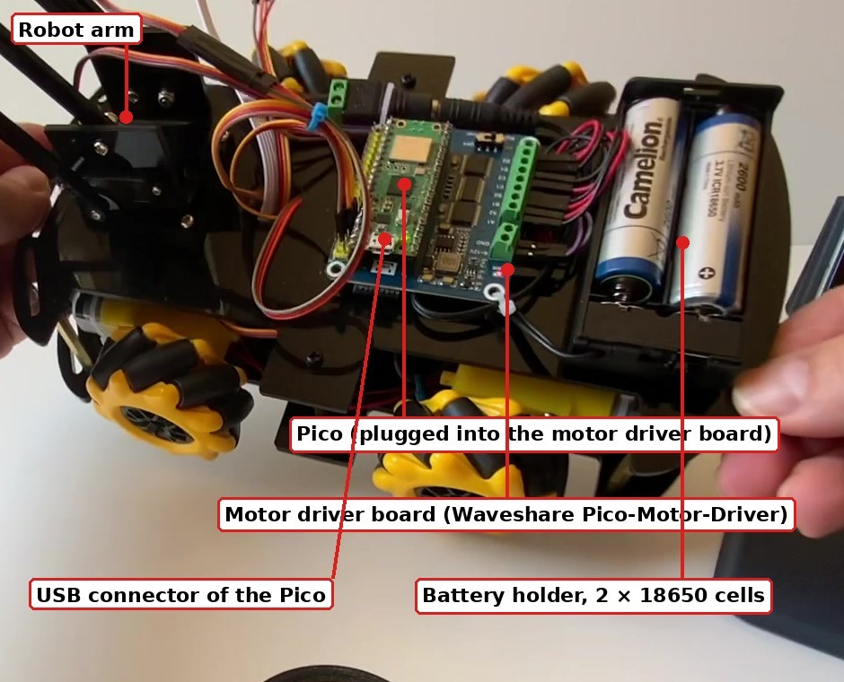

# PicoBot

**Erasmus+ project ROBO STEAM ACADEMY** (KA220-VET-7CF4F308) — co-funded by the European Union — <https://robosteam.eu/>

Part of the **PicoBot Teachers' Toolkit** (lesson plans, student materials, slides and guides in five languages):
<https://github.com/robosteamdev/robo-steam-academy-teachers-toolkit>

**PicoBot** is the educational robot of the Erasmus+ project ROBO STEAM ACADEMY: a small **mecanum-wheel** robot with a
three-servo **arm**, built on the **Raspberry Pi Pico 2 W** (or Pico W) and programmed in **MicroPython**. It drives in
every direction — forward, sideways, diagonally and on the spot — picks up and places objects, follows lines, avoids
obstacles, and takes part in the project's robot competitions. This repository is the **starting point**: it shows
where everything is.

## Main parts

| Part | Details |
|---|---|
| Controller | Raspberry Pi Pico 2 W (or Pico W) on a motor driver board |
| Drive | 4 mecanum wheels with DC motors, driven through a PCA9685 board (I2C) |
| Arm | 3 servos — base, arm, gripper — on a second PCA9685 servo driver board (I2C) |
| Sensors | 5-channel line sensor (Cytron Maker Line), ultrasonic distance sensor (HC-SR04) |
| Power | 2 × 18650 Li-ion cells (7.4 V) with an on/off switch |

## Robot design document

**[PicoBot Robot Design](PicoBot_Robot_Design_v4.pdf)** (Version 4.0, PDF, 41 pages) is the complete engineering description of PicoBot. It covers every part of the robot, from the chassis and the mecanum drive to the arm, electronics, power supply and control software.

**Also available in:** [Български (Bulgarian)](PicoBot_Robot_Design_v4_bg.pdf) · [Română (Romanian)](PicoBot_Robot_Design_v4_ro.pdf) · [Slovenčina (Slovak)](PicoBot_Robot_Design_v4_sk.pdf) · [Українська (Ukrainian)](PicoBot_Robot_Design_v4_uk.pdf)

For each part it answers four questions:

1. **What is it?** — the part, its main technical data and its job on the robot.
2. **Why was it chosen?** — the requirement it meets and why it fits better than the usual alternatives.
3. **How does it work?** — the physical or electrical principle, explained well enough to understand, repair and extend the robot.
4. **How does it interact with the rest of the robot?** — power, signals, buses, software.

It contains:

- **Mechanics** — chassis, placement of the parts, how mecanum wheels work, kinematics, motors, the robot arm and its workspace.
- **Electronics** — controller, motor driver, servo driver, battery, power distribution, the two I2C buses, line and ultrasonic sensors, and the full pin map.
- **Control software** — software layers, motion control, web and joystick control, the programs for the four reference tasks, and the safety functions.
- **Safety, verification and limitations** — design measures and operating rules, what was tested, known limitations and recommended improvements.
- **Appendices** — bill of materials, the complete wiring list and references to the data sheets.

It is written for anybody who wants to build, repair, adapt or improve PicoBot.

## Start here

1. **Get the Teachers' Toolkit** — lesson plans, student materials, slides, reference documents (see below).
2. **Build the robot** — A2 Assembly and maintenance guide and the assembly video V1.
3. **Set it up and check it** — install MicroPython and Thonny (A3 Software set-up), then run the checks of
   [picobot-setup](https://github.com/robosteamdev/picobot-setup).
4. **First programs** — [picobot-web-control](https://github.com/robosteamdev/picobot-web-control): drive the robot and move the arm from a phone.
5. **Teach the course** — the lessons of the toolkit; all their programs are in `lesson_programs/` of this repository.

## What is in this repository

| Folder | Contents |
|---|---|
| `library/` | the PicoBot library: the files the lesson programs expect on the Pico |
| `lesson_programs/` | all tested programs of the toolkit lessons, one folder per module |
| `docs/` | the S3 quick reference cards (Thonny, Python, MicroPython, library, pins, moves and safety) to print |
| `images/` | pictures for this page |

## All PicoBot repositories

| Repository | Contents |
|---|---|
| [picobot-setup](https://github.com/robosteamdev/picobot-setup) | set-up and test programs, the library, assembly (A2) and hardware (A1) documents |
| [picobot-web-control](https://github.com/robosteamdev/picobot-web-control) | drive the robot and move the arm from a web page on a phone |
| [picobot-line_following](https://github.com/robosteamdev/picobot-line_following) | line follower with a live sensor view and settings on a phone |
| [picobot-obstacle-avoidance](https://github.com/robosteamdev/picobot-obstacle-avoidance) | drives around obstacles with the ultrasonic sensor |
| [picobot-mission-control](https://github.com/robosteamdev/picobot-mission-control) | object manipulation mission: follow the line, pick up and place an object, return |
| [picobot-lap-counting](https://github.com/robosteamdev/picobot-lap-counting) | line following that counts the laps on a marker line |
| [picobot-joystick-control](https://github.com/robosteamdev/picobot-joystick-control) | joystick web control over WebSocket (Master Control competition) |
| [picobot-competition-library](https://github.com/robosteamdev/picobot-competition-library) | the robot receives START and STOP from the competition platform |
| [robosteam-competitions](https://github.com/robosteamdev/robosteam-competitions) | the competition platform: scoreboard and competition management |
| [robosteam-lap-timer](https://github.com/robosteamdev/robosteam-lap-timer) | lap timer firmware (NodeMCU ESP8266 with an infrared beam) |
| [robosteam-competition-3d-prints](https://github.com/robosteamdev/robosteam-competition-3d-prints) | 3D-printable equipment: lap-timer box, obstacles, garage cells, garbage containers |
| [robo-steam-academy-teachers-toolkit](https://github.com/robosteamdev/robo-steam-academy-teachers-toolkit) | the download links of the Teachers' Toolkit |

## Teachers' Toolkit — download

| Language | Link |
|---|---|
| English | <https://cloud.streamitproject.eu/index.php/s/yN5Rb28KStpXd7Y> |
| Български (Bulgarian) | <https://cloud.streamitproject.eu/index.php/s/rRPCdZygnjXnLC5> |
| Română (Romanian) | <https://cloud.streamitproject.eu/index.php/s/6ZyCwBNYEp6a9oz> |
| Slovenčina (Slovak) | <https://cloud.streamitproject.eu/index.php/s/K795484WefcyXdN> |
| Українська (Ukrainian) | <https://cloud.streamitproject.eu/index.php/s/BfrKJKxNok568b7> |

## Videos

Subtitles in English, Bulgarian, Romanian, Slovak and Ukrainian (press **CC** on YouTube).

| Video | Link |
|---|---|
| V1 PicoBot assembly - build the robot step by step | <https://www.youtube.com/watch?v=kURZ2_49MeE> |
| V2 PicoBot demo - mecanum moves and arm control from a web page | <https://www.youtube.com/watch?v=Bz0MArCKrIQ> |
| V3 PicoBot object manipulation - pick up a cube and place it on a target | <https://www.youtube.com/watch?v=MrGmpOJrRMA> |
| V4 PicoBot garbage collection - two robots pick up foam balls | <https://www.youtube.com/shorts/GdaHDtyYFLE> |
| V5 PicoBot obstacle avoidance with an ultrasonic sensor | <https://www.youtube.com/shorts/-lE8YsaX5aQ> |
| V6 PicoBot line following with a live sensor view on a phone | <https://www.youtube.com/shorts/pWShT70neII> |
| V7 RoboSTEAM Academy Competitions Platform - Participant Guide | <https://www.youtube.com/watch?v=o5tVkmkcWV4> |

## Competitions

Competition information, rules and how to take part: <https://competitions.robosteam.eu/> · live scoreboard:
<https://live.robosteam.eu/>

## Licence and credits

Code (`library/`, `lesson_programs/`): MIT licence (see `LICENSE`). Documents and pictures (`docs/`, `images/`): CC BY 4.0
(<https://creativecommons.org/licenses/by/4.0/>). Please credit "ROBO STEAM ACADEMY, Erasmus+ project KA220-VET-7CF4F308" —
<https://robosteam.eu/>

Funded by the European Union. Views and opinions expressed are however those of the author(s) only and do not
necessarily reflect those of the European Union or the Human Resource Development Centre (HRDC). Neither the European
Union nor the granting authority can be held responsible for them.
